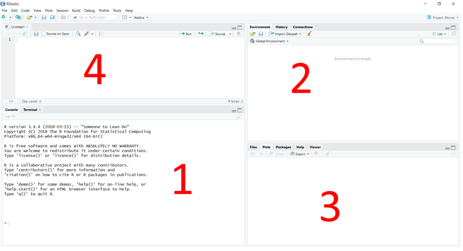

# Instructions for installing R

Go to the [R-project website](https://cran.ma.imperial.ac.uk/) and download the latest version of R. Currently (2018-03-26), the latest and more stable version of R is R v3.4.4. The quickest way to install R is to download the precompiled binary distributions of the base system and contributed packages, so you can download the installer for either [Linux](https://cran.ma.imperial.ac.uk/), [Mac OS X](https://cran.ma.imperial.ac.uk/bin/macosx/R-3.4.4.pkg), or [Windows](https://cran.ma.imperial.ac.uk/bin/windows/base/R-3.4.4-win.exe). Then, please just follow the default installation settings, where you will only have to choose your preferred location to install R. If you are a Mac user, note that you need to have XQuartz installed. If you are a Linux user, please follow the instructions to install R according to your distribution ([Ubuntu](https://cran.ma.imperial.ac.uk/bin/linux/ubuntu/README.html), [Debian](https://cran.ma.imperial.ac.uk/bin/linux/debian/), [Red Hat](https://cran.ma.imperial.ac.uk/bin/linux/redhat/README), [SuSE](https://cran.ma.imperial.ac.uk/bin/linux/suse/README.html))

# Instructions for installing RStudio

Once you have R installed, we are going to install RStudio, a set of integrated tools designed to help you be more productive with R. Go to the [RStudio website](https://www.rstudio.com/products/rstudio/download/) and download the **FREE** installer version. The current version (2017-03-26) is RStudio v1.1.442. Please download the correct installer according to your platform, i.e. Ubuntu, Windows, Mac OS X, etc.
Choose the location for the installer, execute it, and follow the **default instructions** to install it. The only thing that you will have to specify during the installation procedure is where you want R to be installed.

After that, just open RStudio and you are ready to use R! :)  

# Working with RStudio

The layout of RStudio has 3 main panels, although a fourth panel is available when you open your scripts:

### (1) **The R console**
Here you can type the R commands and visualize the content of your objects. One of its most useful utilities is the code completion. Imagine that you do not remember the proper spelling of a function you want to use (or you just do not feel like typing all the word :stuck_out_tongue:). If you start typing part of its name, you will start to see how the R console lists all possible functions that contain the letters you have typed, among which you might find the one you are looking fore. The code completion works also with the names you have given to your R functions and/or objects during the current R project session or that you have loaded from your script.

### (2) **Environment/History/Connections tabs**:
* **Environment** : Under this tab, you will see a list of everything you have defined/loaded/created during your R project session, i.e. functions, objects, packages... You can also save this import your data sets from the `Import Dataset` button, although we recommend you to use the command for that purpose (remember we are here to learn some programming! :muscle: ). You can also either save the current environment you are working on or load previous environments you have previously saved. For instance, this might be interesting to do if your environment has objects that have taken a while to create. Last, if you want to clean this environment (erase everything you have defined/loaded/created before), you can click the brush button (or type `rm( list = ls() )` in the console!). Bear in mind that, once you do this, you will have to run all the commands you used to create any data set you had in your environment.

* **History**: This tab lists **all** the commands you have typed and run in the R console from the first moment you started your project. This means that, even one of your commands did not work or caused an error, it will be printed there. You can either save your History or not when you close your R project session. 

* **Connections**: This tab is a new feature in RStudio and you can mainly use it to connect to different data sources. We are not going to be using this during the workshop, but you can read more about it [here](https://support.rstudio.com/hc/en-us/articles/115010915687).

### (3) **Files/Plots/Packages/Help/Viewer tabs**: 
* **Files**: After setting your working directory *( **(a) pro mode**: type in the R console `setwd( path_to_your_wd )` || **(b) the other less fancy way**: Go to `Session > Set Working Directory > Choose Directory ...` and navigate through your filesystem until your working directory )*, you will see here all the files you have in this location. You can create new folders from here, rename your files, and any of the functions listed under the `More` button.

* **Plots**: Any plots you generate will be viewed here. The Plots tab is where all of the charts and plots you generate will appear. In this tab you may configure, zoom, and inspect your graphs. The Plots tab will contain all of your graphs that have been run in your current Console section. To toggle between graphs, select the arrows and go to the graphic you wish to see.

* **Packages**: You can use this tab here to install any package you want to use in your R project session. However, we are not going to be using this tab for our project. We are going to use the command `install.packages( name_package )`, which is a much faster and convenient way to install any package. However, you can have a look at the options provided under this tab.

* **Help**: Instead of having to google the documentation of any package you want to use, you can directly use this tab to view it. The only thing you need to do is type in the R consol the question mark followed by the command you have questions about. Automatically, you will see how the help documentation is visible under this tab :smiley: 

* **Viewer**: This tab is used to view local web content. We are not going to use this tab for the workshop, but you can visit [this website](https://support.rstudio.com/hc/en-us/articles/202133558-Extending-RStudio-with-the-Viewer-Pane) if you are interested in what it can do.

### (4) **Text editor panel**: 

This panel is only visible if you open a file to edit in RStudio. In order to do this, you can either open one of your scripts ( (i) Go to `File > Open File...` or (ii) find your script in your filesystem and choose to open with RStudio) or start a new script from scratch. For the latter, press the button with a blank file and a green "+" and select the kind of file you want to open. For this workshop, we are going to be coding in R, thus you want an R script. As you see here, you can also use the `ctrl+shift+N` to open a new R script file. 

### **SOME USEFUL TIPS**
* We recommend to type all your commands in the R script instead of typing them in the R console. This is because you can later save this R script as a file, which means that you can later open this file and re-run everything that you have been doing during the workshop.

* Before typing a command, ***comment*** what this command does and why you are using it in the previous line starting with a `#`. Be concise, but give as many details as you need to explain why you are using this command and what it does. Think of a comment as a note for yourself and anyone reading the code. You might find it a bit tedious, although it is a good practice to get used to when you start programming. For instance, think about your future you reading a code you wrote 5 years ago in a project you have not been working on for a while. You do not want to spend hours trying to figure out why you wrote the code like this and why you used X function to do Y task, etc. Furthermore, if you are sharing your code with collaborators/supervisor/colleagues/friends, usefuel comments will help them to go through your code and understand how it works.Therefore, make yourself, the people around you, and your future you a favour and comment your code :smile: 
**Take home message**: Comment your code and let everyone be happy. 

* If you want to run the commands you have typed in your R script in the R console, you do not need to copy and paste them from the editor to the console. You only need to type `ctrl+ENTER` (or `command+ENTER` for Mac users) having the mouse in the line you with the command you want to run and it will automatically be loaded and run into the R console. Alternatively, if you want to run some lines of the code you have in your R script, you can also select them with the mouse and type the shortcut while keeping the selection. 
