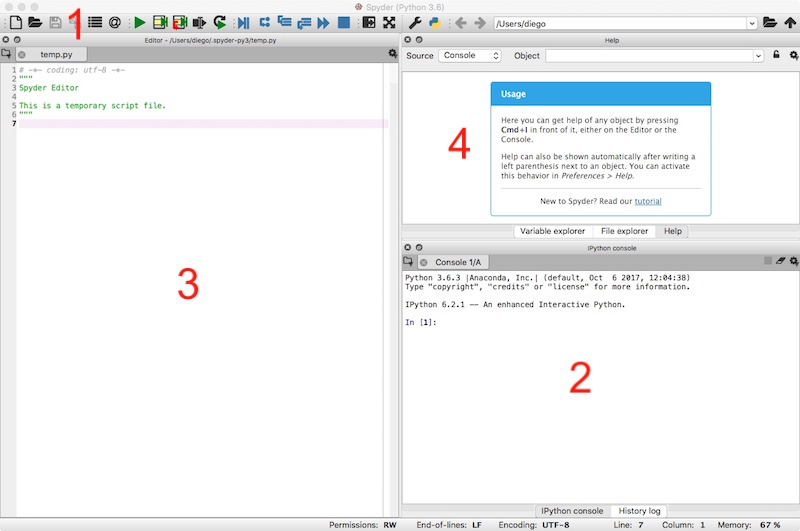
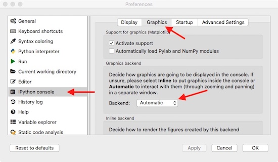

# Installing Python

The very first thing you will need to do in order to use Python is installing it. There are several ways of doing so depending on the operative system (OS) you use and how advanced you are as a user. The simplest way to get started with Python-based scientific computing is using **Anaconda**. 

Anaconda is a Python distribution that includes, as standard, the main packages useful for most research-related task. It also has an easy to use interface to install new packages, a couple of tools for development (Spyder and Jupyter) and a terminal for the more impatient users. 

To download Anaconda, simply click in the following link:

[Download Anaconda](https://www.anaconda.com/download)

You should be offered with the correct version for your OS. During this course, we will use **Anaconda 2018.12** (the newest at the time of writing this gide) with **Python 3.7**. Make sure you click in the correct download button.

The default settings during the installation should be fine in most cases, as long as you do not have other Python 3 already installed in your sistem. If you are using Windows or Mac OS, chances are this is your first Python 3. In some Linux distributions, Python 3 might be installed already, but hopefully Anaconda will not create any conflict. 

## What comes with Anaconda?

Of course, the basic Python 3.6 distribution with all the basic tools you find normally in Python, but also:

- [**Numpy**](http://www.numpy.org): This is the fundamental package for numerical analysis of any kind. Basically, *all* packages that aim to do *any* type of numerical analysis or using *any* type of large data structures, uses it. All the packages mentioned below do so. Among many other things, it provides the ```array``` type of data: esentially vectors and matrices. 

- [**Scipy**](https://docs.scipy.org/doc/scipy/reference/): This package provides the tools and algorithms to solve mathematical problems, ranging from linear and non-linear algebra, differential equations, optimization, etc... 

- [**Matplotlib**](https://matplotlib.org): This is *THE* Python plotting library, incredibly flexible and able of producing almost any type of graph with publication quality. Simply, have a look at the [galery](https://matplotlib.org/tutorials/introductory/sample_plots.html).  

- [**Pandas**](http://pandas.pydata.org): This is a data analysis library, pretty much created to do the same things that *R* does... but in Python. Copying from the documentation "it provides fast, flexible, and expressive data structures designed to make working with “relational” or “labeled” data both easy and intuitive."  

...and many other we do not care, for now. 

## How do I get started?

Anaconda itself is not a piece of software, but rather a bundle of different tools conveniently packed together. To develop Python applications, we will use [Spyder](https://pythonhosted.org/spyder/). To launch Spyder, there are several options depending on your OS:

- **Windows**: There should be an entry called Spyder in the Windows menu, probably inside an entry grouping all Anaconda applications. 
- **Linux and Mac OS X**: Here you can:
    - Fast way: open a terminal, write "spyder" and hit "enter".
    - The visual way: open the Anaconda Navigator, which should appear somewhere in your Applications folder or menu, and then lunch Spyder when given the option.  

Once the application is loaded, it should look something like this (it might be slightly different for different OS):



It has four parts:

1. The menu bar (top), with buttons to open files, run a script, change directory, debug your code, etc. 

2. The IPython interpreter (bottom right). Here you can run Python commands and it is also where you will see the output of your scripts when you execute them. 

3. The script window (left) where you will write your scripts, i.e. your Python programs. 

4. A multi-purpose window (top right), where you can look for help regarding functions, change the directory and, more importantly, explore the variables that have been already defined in the IPython interpreter (2).   

**Note**: by default, any graph will appear within the IPython window, which is rather small and not interactive. To make it appear as a separate window and be able to interact with it, go to Preferences > IPython console > Graphics and there change the backend to "Automatic". Then, re-start Spyder. 



## Other packages

Based on the information you have provided during the registration process, there are a few other packages that we will use during the course, specific for one or other type of analysis. We will go through some examples using this packages, so even if you are not interested on the tools they provide, it will be useful for your to install them. As before, there are several ways of doing this, depending on your OS, but we will focus on the *fast way*:

- **Windows**: Open the "Anaconda promp", which should be in the Windows menu, together with Spyder. 
- **Linux and Mac OS X**: Open a terminal.

Depending on the package, we will use a slightly different command. See below for each of them. The extra packages we are interested in are:

- [**Flow Cytometry Tools**](https://eyurtsev.github.io/FlowCytometryTools/index.html): A flow cytometry analysis library. The documentation includes several examples and figures showing what it can do (all created with Matplotlib). It has some sort of front end to help to define some basic gates. To install, execute:

    ```pip install flowcytometrytools```

- [**OpenCV**](https://opencv.org): A library to deal efficiently with images, either in real time (capture from a camera) or in postprocessing. The official wabpage is more focussed in its use in C++, so have a look at the ["unofficial" documentation for opencv-python](https://opencv-python-tutroals.readthedocs.io/en/latest/index.html#), with step by step examples on how to do different things with images. To install, execute:  

    ```conda install opencv```

- [**Biosppy**](http://biosppy.readthedocs.io/en/stable/): This is a toolbox for biosignal processing written in Python. The toolbox bundles together various signal processing and pattern recognition methods geared torwards the analysis of biosignals. To install, execute:

    ```pip install biosppy```

- [**lmfit**](https://lmfit.github.io/lmfit-py/): It is a high-level interface for fitting data. Esencially, it is a way more-friendly and easy to use method of using the Scipy optimization routines. 

    ```pip install lmfit```
